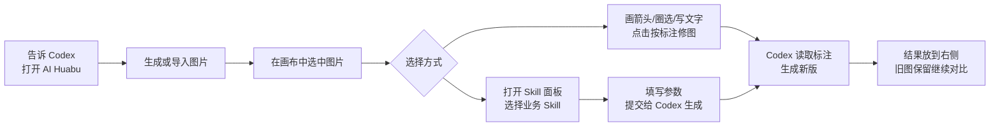
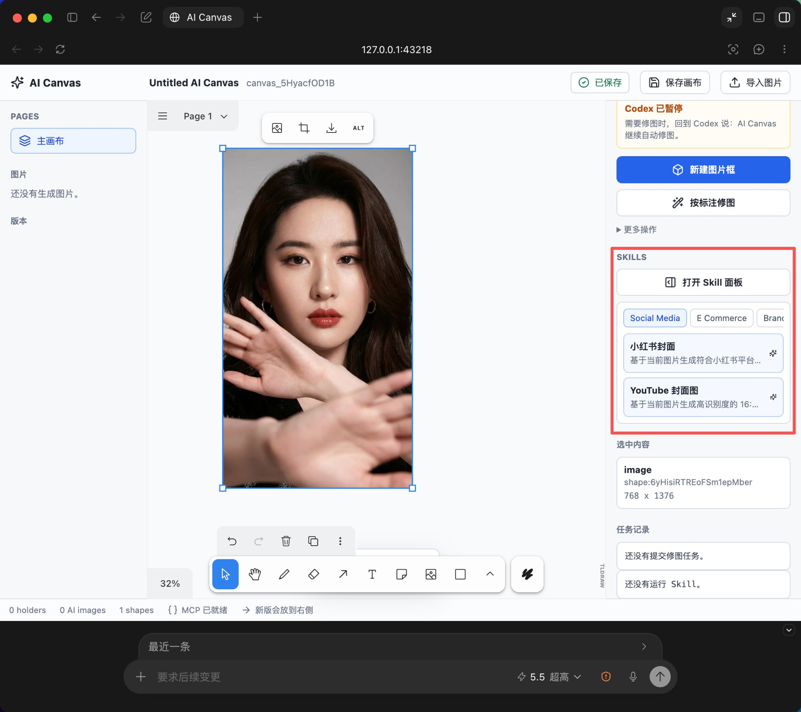
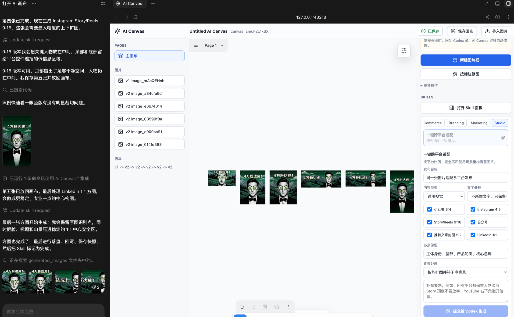

<div align="center">

  

# AI Huabu

### Codex 里的 AI 无限画布：生成图片、标注修图、Skill 工作流一次完成

[](./LICENSE)
[](#快速安装)
[](./ai-huabu-codex-plugin/.mcp.json)
[](./ai-huabu-codex-plugin/package.json)
[](./ai-huabu-codex-plugin/package.json)
[](./README.md)
[](./README.en.md)

**中文** · [English](./README.en.md)

[快速安装](#快速安装) · [界面展示](#界面展示) · [核心能力](#核心能力) · [Skill 工作流](#skill-工作流) · [使用流程](#使用流程) · [隐私说明](#隐私说明)

</div>

---

## 这是什么？

AI Huabu 是一个面向 Codex 的本地 AI Huabu插件。它把「自然语言生成图片」「在画布上标注修改」「一键提交业务 Skill」「多版本对比」放到同一个工作流里。

你可以把它理解成：

```text
Codex 里的 AI 画图白板 + 业务制图工作台。
```

普通用户不需要理解 MCP、holder、run metadata 或本地文件路径。你只需要说需求、打开画布、选择图片、标注或提交 Skill，Codex 会把结果放回画布。

## 核心能力

| 能力 | 说明 |
| --- | --- |
| 自然语言生成图片 | 让 Codex 直接生成广告图、封面、海报、产品图、Logo 或视觉概念图。 |
| 本地无限画布 | 打开基于 tldraw 的本地画布，适合持续标注、摆放素材和横向对比版本。 |
| 按标注修图 | 箭头、文字、圆圈、矩形会被理解成修图意见，点击 `按标注修图` 即可提交给 Codex。 |
| Skill 面板 | 内置社媒、电商、品牌、营销、Studio 五类业务 Skill，可从右侧面板选择并填写参数。 |
| 多图批量产出 | 产品组图、品牌系统、宣传册、跨平台适配等 Skill 会按任务自动生成多张结果图。 |
| 本地优先 | 画布服务运行在 `127.0.0.1`，运行数据默认保存在当前工作区，不依赖托管后端。 |

## 快速安装

### 推荐方式：直接从 GitHub 安装

```bash
codex plugin marketplace add https://github.com/jiuwanfan/AI-huabu --ref main
codex plugin add ai-huabu-codex-plugin@ai-huabu
```

安装后重启 Codex，或新开一个对话，然后输入：

```text
@AI Huabu 打开 AI Huabu，帮我做一张拉面广告。
```

### 开发者本地安装

```bash
git clone https://github.com/jiuwanfan/AI-huabu.git
cd AI-huabu/ai-huabu-codex-plugin
npm run setup
cd ..
codex plugin marketplace add .
codex plugin add ai-huabu-codex-plugin@ai-huabu
```

完整安装、更新和排错说明：

- [安装指南 INSTALL.md](./ai-huabu-codex-plugin/INSTALL.md)
- [中文小白使用说明](./ai-huabu-codex-plugin/使用说明.md)

## 使用流程



日常使用：

1. 在 Codex 里说：`@AI Huabu 打开 AI Huabu`。
2. 让 Codex 生成图片，或在画布里上传、拖拽、粘贴图片。
3. 需要局部修改时，在图片附近画箭头、圆圈、矩形并写文字，再点击 `按标注修图`。
4. 需要业务化产出时，选中图片，打开右侧 `Skill 面板`，选择对应 Skill。
5. 第一次处理 Skill 前，在 Codex 里说：`@AI Huabu 继续处理画布里的 Skill 请求`。
6. 在画布里填写参数并点击 `提交给 Codex 生成`，结果会自动放到原图右侧。


<div align="center">
  
</div>


### 一键跨平台适配

在 `Studio` 分类选择 `一键跨平台适配`。选择发布平台、内容类型、文字处理、必须保留元素和背景策略后，Codex 会按平台比例、安全区和展示场景重构图片。

<div align="center">
  
</div>

## 常用提示词

```text
@AI Huabu 打开 AI Huabu，帮我做一张小红书封面。

@AI Huabu 生成一张竖版拉面广告，品牌叫拉面一番，要高级食物摄影风格。

@AI Huabu 开启自动修图模式。

@AI Huabu 继续处理画布里的 Skill 请求。

@AI Huabu 按我画布上的标注修改。
```

## 适合谁用

| 用户 | 可以怎么用 |
| --- | --- |
| 自媒体创作者 | 做小红书封面、YouTube 缩略图、短视频封面、跨平台发布图。 |
| 电商卖家 | 把单张产品图扩展成主图、卖点图、场景图和广告图。 |
| 品牌/产品团队 | 快速探索 Logo 方向、品牌视觉板、活动物料和产品概念图。 |
| 设计协作场景 | 把画布当成 Codex 里的视觉讨论工作台，一边标注一边迭代。 |
| 非设计用户 | 不用学习专业设计软件，也能用自然语言和表单完成常见业务图。 |

## 项目文档

- [插件说明 README](./ai-huabu-codex-plugin/README.md)
- [安装指南 / Installation Guide](./ai-huabu-codex-plugin/INSTALL.md)
- [中文小白使用说明](./ai-huabu-codex-plugin/使用说明.md)
- [自然语言工作流](./ai-huabu-codex-plugin/自然语言工作流.md)
- [English README](./README.en.md)

## 仓库结构

```text
.agents/plugins/marketplace.json
ai-huabu-codex-plugin/
  .codex-plugin/plugin.json
  .mcp.json
  skills/
  packages/
    canvas-app/
    mcp-server/
    shared/
assets/
  ai-huabu-interface-preview.png
  skills/
```

Codex 会读取仓库根目录的 `.agents/plugins/marketplace.json`，这个 marketplace 指向 `./ai-huabu-codex-plugin`。

## 隐私说明

- 画布服务运行在本机 `127.0.0.1`，默认端口 `43218`。
- 画布状态和生成资源默认保存在当前工作区的 `.ai-huabu/`，除非设置了 `AI_HUABU_HOME`。
- 本地运行数据、测试生成图片、临时 QA 数据、依赖目录、日志和环境变量文件都被 Git 忽略。
- 插件不包含托管后端，它是一个本地 Codex 插件工作流。

## 开发

```bash
cd ai-huabu-codex-plugin
npm run setup
npm run typecheck
npm run test
npm run validate:plugin
```

手动预览画布服务：

```bash
NODE_ENV=production node packages/canvas-app/dist/server/server.js \
  --port 43218 \
  --workspace-root "<your workspace>"
```

打开：

```text
http://127.0.0.1:43218/
```

